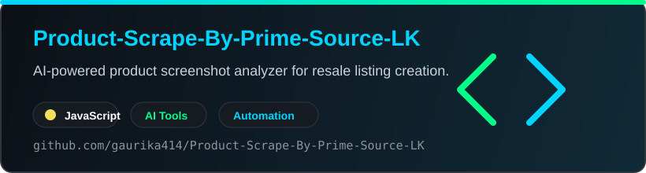

<p align="center">
  
</p>

<p align="center">
  
</p>

<p align="center">
  <a href="https://github.com/gaurika414">
    
  </a>
  <a href="https://github.com/gaurika414?tab=followers">
    
  </a>
  <a href="https://github.com/gaurika414?tab=repositories">
    
  </a>
</p>

<p align="center">
  <a href="https://linkedin.com/in/gaurikabimsara">
    
  </a>
  <a href="mailto:gaurika885@icloud.com">
    
  </a>
  <a href="https://github.com/gaurika414">
    
  </a>
</p>

---

## About Me

I am **Gaurika Bimsara**, an aspiring software developer from Sri Lanka focused on **Python, web development, cybersecurity, and software engineering fundamentals**.

I build practical projects, learn algorithms and debugging, explore Linux and security fundamentals, and manage a **2000+ member cybersecurity community** where I share resources and support technical discussions.

```python
gaurika = {
    "role": "Aspiring Software Developer",
    "location": "Sri Lanka",
    "focus": ["Python", "Web Development", "Cybersecurity", "Software Engineering"],
    "currently_learning": ["JavaScript", "SQL", "Linux CLI", "AI-powered tools"],
    "community": "Founder of a 2000+ member cybersecurity community",
    "languages": ["English: Proficient", "Tamil: Intermediate"]
}
```

## Tech Stack

<p align="center">
  
</p>

<p align="center">
  
  
  
  
  
  
</p>

## What I Work On

| Area | What I am building |
| --- | --- |
| Software Development | Python scripts, algorithms, debugging practice, and problem-solving exercises |
| Web Development | Responsive web pages using HTML5, CSS3, clean layout structure, and browser-friendly styling |
| Cybersecurity | Digital safety awareness, networking basics, security learning resources, and community moderation |
| AI Tools | Practical automation ideas and AI-assisted product analysis workflows |
| Documentation | Clear technical notes, project READMEs, and learning documentation |

## Core Strengths

- Software development fundamentals
- Problem solving and analytical thinking
- Self-learning and technical research
- Technical documentation
- Cybersecurity community management

## Featured Work

<p align="center">
  <a href="https://github.com/gaurika414/Product-Scrape-By-Prime-Source-LK">
    
  </a>
</p>

| Project | Description | Focus |
| --- | --- | --- |
| Product Scrape By Prime Source LK | AI-powered product screenshot analyzer for resale listing creation | AI tools, automation, product analysis |
| Cybersecurity Community Platform | Built and managed a Telegram tech community with 2000+ members | Cybersecurity, community leadership, moderation |
| Web Development Practice | Created responsive web pages focused on structure, styling, and compatibility | HTML5, CSS3, UI structure |
| Python Practice Projects | Implemented scripts and exercises using loops, functions, and logic | Python, algorithms, debugging |

## GitHub Analytics

<p align="center">
  
  
</p>

<p align="center">
  
  
</p>

<p align="center">
  
</p>

<p align="center">
  
</p>

## Contribution Animation

<p align="center">
  <picture>
    <source media="(prefers-color-scheme: dark)" srcset="https://raw.githubusercontent.com/gaurika414/gaurika414/output/github-contribution-grid-snake-dark.svg" />
    <source media="(prefers-color-scheme: light)" srcset="https://raw.githubusercontent.com/gaurika414/gaurika414/output/github-contribution-grid-snake.svg" />
    
  </picture>
</p>

## Current Goals

- Build stronger Python and JavaScript projects with clean documentation.
- Publish more practical cybersecurity and web development learning projects.
- Improve SQL, Linux CLI, networking, and software engineering fundamentals.
- Turn learning into public repositories that show real progress and consistency.

## Connect

<p align="center">
  <a href="https://linkedin.com/in/gaurikabimsara">LinkedIn</a>
  |
  <a href="mailto:gaurika885@icloud.com">Email</a>
  |
  <a href="https://github.com/gaurika414">GitHub</a>
</p>

<p align="center">
  
</p>
